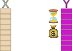

```{r, include=FALSE, echo=FALSE}

library(tidyverse)
library(lubridate)
library(ggridges)
library(gt)
library(table.glue)
library(palmerpenguins)
library(ggforce)
library(rpart)
library(party)
library(rpart.plot)
library(parttree)
library(splines)
library(magick)
library(ggforce)

knitr::opts_chunk$set(echo = FALSE, 
                      message = FALSE,
                      warning = FALSE,
                      dpi = 300,
                      fig.height = 7, 
                      fig.width = 11,
                      fig.align = 'center')

thm  <- theme_bw() + 
  theme(
    text = element_text(size=18, face = 'bold'),
    panel.grid = element_blank()
  )

theme_set(thm)

source("R/bench_pred_viz.R")

```

```{r xaringan-banner, echo=FALSE}

xaringanExtra::use_banner(
 top_left = "",
 top_right = "Byron C Jaeger",
 bottom_left = "byronjaeger.com/talk",
 exclude = c("inverse")
)

```

```{css, echo = FALSE}
.huge { font-size: 200% }
.large { font-size: 130% }
.small { font-size: 70% }
```

# Hello! My name is Byron 

.left-column[

I am an R enthusiast

I like walking my dog and learning (easy) cocktail recipes.

I study <br/> risk prediction using machine learning, generally cardiovascular disease.

]

.right-column[


]

---
class: center, middle, inverse

# .huge[Background]

---

## Two types of machine learning

.pull-left[

### Supervised

.large[Labeled data]

.large[Predict an outcome]

.large[Learners]

.large[Risk prediction]


]

.pull-right[

### Unsupervised

.large[Unlabeled data]

.large[Find structure]

.large[Clusters]

.large[Organize medical records]


]

---

## For today

.pull-left[

### Supervised

.large[Labeled data]

.large[Predict an outcome]

.large[Learners]

.large[Risk prediction]

]

---
class: center, middle, inverse

# .huge[Labeled data]

---
layout: true
## Labeled data

---

```{r out.width='90%', echo=FALSE, fig.align='center'}
knitr::include_graphics('img/ml-supervised-1.svg')
```

---


```{r out.width='90%', echo=FALSE, fig.align='center'}
knitr::include_graphics('img/ml-supervised-1-1.svg')
```

---

```{r out.width='90%', echo=FALSE, fig.align='center'}
knitr::include_graphics('img/ml-supervised-1-2.svg')
```

---

```{r out.width='90%', echo=FALSE, fig.align='center'}
knitr::include_graphics('img/ml-supervised-1-3.svg')
```

---

```{r out.width='90%', echo=FALSE, fig.align='center'}
knitr::include_graphics('img/ml-supervised-2.svg')
```

---

```{r out.width='90%', echo=FALSE, fig.align='center'}

```

---

```{r out.width='90%', echo=FALSE, fig.align='center'}
knitr::include_graphics('img/ml-supervised-4.svg')
```

---

```{r out.width='90%', echo=FALSE, fig.align='center'}
knitr::include_graphics('img/ml-supervised-5.svg')
```

---
layout: false
class: center, middle, inverse

# .huge[Predict an outcome]

---
layout: true

## Predict an outcome

---

```{r out.width='90%', echo=FALSE, fig.align='center'}
knitr::include_graphics('img/ml-supervised-6.svg')
```

---

```{r out.width='90%', echo=FALSE, fig.align='center'}

```

---

```{r out.width='90%', echo=FALSE, fig.align='center'}
knitr::include_graphics('img/ml-supervised-7-1.svg')
```

---

```{r out.width='90%', echo=FALSE, fig.align='center'}
knitr::include_graphics('img/ml-supervised-7-2.svg')
```

---
layout: false
class: center, middle, inverse

# .huge[Learners]

--

## .huge[(jargon)]

---

## Learners


.large[A *learner* is like a recipe for a prediction model]

--

- .large[A learner is not the same thing as a prediction model]

- .large[A recipe is not the same thing as the food!]

---
layout: false 

## Find a good learner for these data

```{r}

set.seed(329)

n <- 75
x <- runif(n, min = 100, max = 160)

y_true <- scales::rescale(exp(-x/20), to = c(1, 12)) 
y_obs <- pmax(pmin(y_true + rnorm(n, mean=1), 15), 1)

ggdata <- tibble(x = x, y = y_obs)

p <- ggplot(ggdata) + 
 aes(x = x, y = y) + 
 labs(y = "Time until next blood pressure measure, months",
      x = "Systolic blood pressure today, mm Hg") + 
 scale_y_continuous(limits = c(-2, 15),
                    breaks = c(0, 2, 4, 6, 8, 10, 12, 14)) + 
 scale_x_continuous(limits = c(100, 160),
                    breaks = c(100, 120, 140, 160))
points <- geom_point(shape = 21, 
                     color = 'black', 
                     fill = 'orange', 
                     size = 4.5)
points_light <- geom_point(shape = 21, 
                           color = 'black', 
                           fill = 'orange', 
                           size = 4.5, 
                           alpha = 0.25)
p + points

m1 <- lm(y ~ x, data = ggdata)

x_new <- data.frame(x = seq(min(x), max(x), len = 1000))

yhat_m1 <- m1 %>% 
 predict(newdata = x_new)

m2 <- lm(y ~ bs(x, degree = 3), data = ggdata)

yhat_m2 <- m2 %>% 
 predict(newdata = x_new)

m3 <- lm(y ~ bs(x, degree = 15), data = ggdata)

yhat_m3 <- m3 %>% 
 predict(newdata = x_new)

```

---

## Learner 1: find the line of best fit


```{r}
p + points + 
 geom_line(data = tibble(y = yhat_m1, x = x_new$x),
           color = 'purple', 
           size = 1.5)
```

---

## Learner 1: find the line of best fit

```{r}


raster <- image_read('img/person-standing.png') %>% 
 image_fill('none') %>% 
 as.raster()

circle_data <- tibble(
 x = 120,
 y = predict(m1, newdata = tibble(x=x)),
 label = paste("Our model's prediction\nfor Bill:", 
               round(y, 1), 'months')
)

p + points_light + 
 geom_line(data = tibble(y = yhat_m1, x = x_new$x),
              color = 'purple', 
              size = 1.5) + 
 geom_mark_circle(data = circle_data, 
                  aes(label = label), 
                  fill = 'orange', 
                  label.fontsize = 15,
                  expand = 0.02, 
                  label.fill = 'grey90') + 
 geom_segment(x = 120, 
              y = 2, 
              xend = 120, 
              yend = 6.3) + 
 annotate(geom = 'text',
          size = 6,
          x = 113,
          y = 1.5, 
          label = "Bill's SBP:\n120 mm Hg") +
 annotation_raster(raster, 
                   ymin = -2.2, 
                   ymax = 2, 
                   xmin = 115, 
                   xmax = 125)
```

---

## Learner 2: Use a spline

```{r}

p + points + 
 geom_line(data = tibble(y = yhat_m2, x = x_new$x),
           color = 'purple', 
           size = 1.5)

```

---

## Learner 3: Loosen the spline

```{r}

p + points + 
 geom_line(data = tibble(y = yhat_m3, x = x_new$x),
           color = 'purple', 
           size = 1.5)

```

---

## Which learner is best here?

Visualization helps, but isn't always feasible and actionable

--

**Cross validation**:

- Hold some data out as a testing set

- Apply each learner to the remaining data (training set)

- Predict the outcome using each model (one model per learner)

- Evaluate prediction accuracy

- _Repeat_

---

## All our data

```{r}

test_index <- c(
 13, 
 10, 
 25,
 42
)


train <- ggdata[-test_index, ]
test <- ggdata[test_index, ]

m1 <- lm(y ~ x, data = train)

x_new <- data.frame(x = seq(min(ggdata$x), max(ggdata$x), len = 1000))

yhat_m1 <- m1 %>% 
 predict(newdata = x_new)

m2 <- lm(y ~ bs(x, degree = 3), data = train)

yhat_m2 <- m2 %>% 
 predict(newdata = x_new)

m3 <- lm(y ~ bs(x, degree = 9), data = train)

yhat_m3 <- m3 %>% 
 predict(newdata = x_new)

rmse <- function(pred, truth){
 sqrt(mean((pred-truth)^2))
}

train_error <- list(m1=m1, m2=m2, m3=m3) %>% 
 map_dfr(
  .f = ~ {
   pred <- predict(.x, newdata = train)
   rmse_refer <- rmse(mean(train$y), train$y)
   rmse_model <- rmse(pred, train$y) / rmse_refer
   list(rmse = rmse_model, rsq = 1 - rmse_model/rmse_refer)
  },
  .id = 'model'
 )

test_error <- list(m1=m1, m2=m2, m3=m3) %>% 
 map_dfr(
  .f = ~ {
   pred <- predict(.x, newdata = test)
   rmse_refer <- rmse(mean(train$y), test$y)
   rmse_model <- rmse(pred, test$y) / rmse_refer
   list(rmse = rmse_model, rsq = 1 - rmse_model/rmse_refer)
  },
  .id = 'model'
 )

ggplot(ggdata) +
 aes(x = x, y = y) +
 labs(y = "Time until next blood pressure measure, months",
      x = "Systolic blood pressure today, mm Hg") +
 scale_y_continuous(limits = c(-2, 15),
                    breaks = c(0, 2, 4, 6, 8, 10, 12, 14)) +
 scale_x_continuous(limits = c(100, 160),
                    breaks = c(100, 120, 140, 160)) +
 geom_point(shape = 21,
            color = 'black',
            fill = 'orange',
            size = 4.5)

```

---

## Select a testing set

```{r}

ggplot(ggdata) + 
 aes(x = x, y = y) + 
 labs(y = "Time until next blood pressure measure, months",
      x = "Systolic blood pressure today, mm Hg") + 
 scale_y_continuous(limits = c(-2, 15),
                    breaks = c(0, 2, 4, 6, 8, 10, 12, 14)) + 
 scale_x_continuous(limits = c(100, 160),
                    breaks = c(100, 120, 140, 160)) + 
 geom_point(data = train, 
            shape = 21, 
            color = 'black', 
            fill = 'orange', 
            size = 4.5) + 
 geom_point(data = test, 
            shape = 21, 
            color = 'black', 
            fill = 'cyan4', 
            size = 4.5)

```

---

## Take it away

```{r}

ggplot(train) + 
 aes(x = x, y = y) + 
 labs(y = "Time until next blood pressure measure, months",
      x = "Systolic blood pressure today, mm Hg") + 
 scale_y_continuous(limits = c(-2, 15),
                    breaks = c(0, 2, 4, 6, 8, 10, 12, 14)) + 
 scale_x_continuous(limits = c(100, 160),
                    breaks = c(100, 120, 140, 160)) + 
 geom_point(shape = 21, 
            color = 'black', 
            fill = 'orange', 
            size = 4.5)


p <- ggplot(ggdata[-test_index, ]) + 
 aes(x = x, y = y) + 
 labs(y = "Time until next blood pressure measure, months",
      x = "Systolic blood pressure today, mm Hg") + 
 scale_y_continuous(limits = c(-2, 15),
                    breaks = c(0, 2, 4, 6, 8, 10, 12, 14)) + 
 scale_x_continuous(limits = c(100, 160),
                    breaks = c(100, 120, 140, 160))

```

---

## Apply learner 1

```{r}

p + points + 
 geom_line(data = tibble(y = yhat_m1, x = x_new$x),
           color = 'purple', 
           size = 1.5)

```

---


## Apply learner 2

```{r}

p + points +
  geom_line(data = tibble(y = yhat_m2, x = x_new$x),
           color = 'purple', 
           size = 1.5)

```


---


## Apply learner 3

```{r}

p + points +
  geom_line(data = tibble(y = yhat_m3, x = x_new$x),
           color = 'purple', 
           size = 1.5)

```

---

## Assess predictions in testing data

```{r}

test$pred <- predict(m1, test)
test$pred_error <- test$y - test$pred
test$vjust <- sign(test$pred_error)*-2.5 

p +
 geom_segment(data = test, 
              aes(x=x, xend=x, y=y, yend=pred)) +
 geom_point(data = test,
            shape = 21, 
            color = 'black', 
            fill = 'cyan4', 
            size = 4.5) + 
 geom_line(data = tibble(y = yhat_m1, x = x_new$x),
           color = 'purple', 
           size = 1.5) +
 geom_text(data = test, 
           aes(label=round(pred_error,2),
               vjust = vjust))


```

---

## Assess predictions in testing data

```{r}

test$pred <- predict(m2, test)
test$pred_error <- test$y - test$pred
test$vjust <- sign(test$pred_error)*-2.5 

p +
 geom_segment(data = test, 
              aes(x=x, xend=x, y=y, yend=pred)) +
 geom_point(data = test,
            shape = 21, 
            color = 'black', 
            fill = 'cyan4', 
            size = 4.5) + 
 geom_line(data = tibble(y = yhat_m2, x = x_new$x),
           color = 'purple', 
           size = 1.5) +
 geom_text(data = test, 
           aes(label=round(pred_error,2),
               vjust=vjust))

```

---

## Assess predictions in testing data

```{r}

test$pred <- predict(m3, test)
test$pred_error <- test$y - test$pred
test$vjust <- sign(test$pred_error)*-2.5 

p +
 geom_segment(data = test, 
              aes(x=x, xend=x, y=y, yend=pred)) +
 geom_point(data = test,
            shape = 21, 
            color = 'black', 
            fill = 'cyan4', 
            size = 4.5) + 
 geom_line(data = tibble(y = yhat_m3, x = x_new$x),
           color = 'purple', 
           size = 1.5) +
 geom_text(data = test, 
           aes(label=round(pred_error,2),
               vjust=vjust))

```

---
class: center, middle

## Assess predictions in testing data

```{r}

bind_rows(train = train_error, 
          test = test_error,
          .id = 'data') %>% 
 mutate(model = recode(model,
                       m1 = "Line",
                       m2 = "Spline",
                       m3 = "Loose spline")) %>% 
 mutate(
  rmse = table_value(rmse),
  rsq = table_glue("{100 * rsq}%")
 ) %>% 
 pivot_wider(names_from = data, values_from = c(rmse, rsq)) %>% 
 select(-starts_with('rsq')) %>% 
 gt(rowname_col = 'model', groupname_col = 'data') %>% 
 cols_label(rmse_train = "Training error",
            rmse_test = "Testing error") %>% 
 cols_align('center') %>% 
 tab_stubhead("Learner") %>% 
 tab_options(
  table.width = pct(100),
  table.font.size = px(25),
  heading.title.font.size = px(25),
  heading.subtitle.font.size = px(25),
  column_labels.font.size = px(25),
  row_group.font.size = px(25),
  stub.font.size = px(25)
 )

```

---

## Overfitting?

.large[Adopting a rule in your model that works well in your training data but does not generalize to new data.]

---
class: center, middle, inverse

# .huge[Decision Trees and Random Forests]

---
background-image: url(img/penguins.png)
background-size: 45%
background-position: 85% 72.5%

## Decision trees

- Partitions the space of predictor variables.

- Can be used for classification, regression, and survival analysis. 

.pull-left[
We'll demonstrate the mechanics of decision trees by developing a prediction rule to classify penguin<sup>1</sup> species (chinstrap, gentoo, or adelie) based on bill and flipper length.
]

.footnote[
<sup>1</sup>Data were collected and made available by [Dr. Kristen Gorman](https://www.uaf.edu/cfos/people/faculty/detail/kristen-gorman.php) and the [Palmer Station](https://pal.lternet.edu/), a member of the [Long Term Ecological Research Network](https://lternet.edu/).
]

---

Dimensions for Adelie, Chinstrap and Gentoo Penguins at Palmer Station

```{r fig.align='center', fig.height=5, fig.width=7}

library(palmerpenguins)

penguins <- drop_na(penguins)

ggplot(data = penguins) +
  aes(x = flipper_length_mm, y = bill_length_mm, label = species) +
  geom_point(aes(color = species, shape = species),
             size = 3,
             alpha = 0.8) +
  geom_mark_ellipse(aes(color = species, fill = species), 
                    alpha = 0.075) +
  theme_minimal() +
  scale_color_manual(values = c("darkorange","purple","cyan4")) +
  scale_fill_manual(values = c("darkorange","purple","cyan4")) +
  labs(x = "\nFlipper length, mm",
       y = "Bill length, mm\n",
       color = "Penguin species",
       shape = "Penguin species") +
  coord_cartesian(ylim = c(30, 70),
                  xlim = c(170, 235)) +
  theme(panel.grid = element_blank(),
        legend.position = '')

```

---

Partition all the penguins into flipper length < 207 or ≥ 207 mm

```{r fig.align='center', fig.height=5, fig.width=7}

mdl_tree <- rpart(formula = species ~ flipper_length_mm + bill_length_mm,
                  data = penguins, 
                  control = rpart.control(maxdepth = 1))

ggplot(data = penguins) +
  aes(x = flipper_length_mm, y = bill_length_mm, label = species) +
  geom_point(aes(color = species, shape = species),
             size = 3,
             alpha = 0.8) +
  geom_parttree(data = mdl_tree, aes(fill=species), alpha = 0.1) +
  theme_minimal() +
  scale_color_manual(values = c("darkorange","purple","cyan4")) +
  scale_fill_manual(values = c("darkorange","cyan4")) +
  labs(x = "\nFlipper length, mm",
       y = "Bill length, mm\n",
       color = "Penguin species",
       shape = "Penguin species") +
  coord_cartesian(ylim = c(30, 70),
                  xlim = c(170, 235)) +
  theme(panel.grid = element_blank(),
        legend.position = '')
```

---

Partition penguins on the left side into into bill length < 43 or ≥ 43 mm

```{r fig.align='center', fig.height=5, fig.width=7}

mdl_tree <- rpart(formula = species ~ flipper_length_mm + bill_length_mm,
                  data = penguins, 
                  control = rpart.control(maxdepth = 2))

penguin_fig_2parts <- ggplot(data = penguins) +
  aes(x = flipper_length_mm, y = bill_length_mm, label = species) +
  geom_point(aes(color = species, shape = species),
             size = 3,
             alpha = 0.8) +
  geom_parttree(data = mdl_tree, aes(fill=species), alpha = 0.1) +
  theme_minimal() +
  scale_color_manual(values = c("darkorange","purple","cyan4")) +
  scale_fill_manual(values = c("darkorange","purple","cyan4")) +
  labs(x = "\nFlipper length, mm",
       y = "Bill length, mm\n",
       color = "Penguin species",
       shape = "Penguin species") +
  coord_cartesian(ylim = c(30, 70),
                  xlim = c(170, 235)) +
  theme(panel.grid = element_blank(),
        legend.position = '')

penguin_fig_2parts

```

---

The same partitions, visualized as a binary tree.

```{r fig.align='center', out.width='100%'}

knitr::include_graphics('img/rpart_plot_classif.png')

# png(res = 300,
#     width = 6,
#     height = 3.75,
#     units = 'in',
#     filename = 'img/rpart_plot_classif.png')
# 
# rpart.plot::rpart.plot(mdl_tree,
#                        type = 5,
#                        extra = 4,
#                        box.palette = list("darkorange","purple","cyan4"))
# 
# dev.off()

```

Node text: Penguin species probabilities based on penguins in the leaf

---

## Random Forest, i.e., lots of trees

Each tree is grown through a randomized process so that the trees are somewhat independent from each other

Each randomized tree is _individually weaker_ than a standard decision tree.

The average prediction taken across all the randomized trees is **much** more accurate than a standard decision tree.

```{r}

set.seed(329)

mdl_forest <- ranger::ranger(
 formula = species ~ flipper_length_mm + bill_length_mm, 
 data = penguins,
 probability = TRUE,
 importance = 'permutation'
)

grid <- expand_grid(
 flipper_length_mm = seq(170, 235, len = 150),
 bill_length_mm = seq(30, 70, len = 150)
)


pred <- as_tibble(predict(mdl_forest, data = grid)$predictions)

grid <- bind_cols(grid, pred) %>% 
 pivot_longer(cols = c(Adelie,
                       Chinstrap,
                       Gentoo)) %>% 
 group_by(flipper_length_mm, bill_length_mm) %>% 
 arrange(desc(value)) %>% 
 slice(1)

```


---

Contours of predictions from **individual trees** in a random forest

```{r fig.align='center', fig.height=5, fig.width=7}

ggplot(grid, aes(flipper_length_mm, bill_length_mm)) +
 geom_point(data = penguins,
            aes(color = species, shape = species),
            size = 3,
            alpha = 0.8) + 
 geom_contour_filled(aes(z = value, fill = name),
                     alpha = .25, color = 'black') +
 scale_color_manual(values = c("darkorange","purple","cyan4")) +
 scale_fill_manual(values = c("darkorange","purple","cyan4")) +
 labs(x = "\nFlipper length, mm",
      y = "Bill length, mm\n",
      color = "Penguin species",
      shape = "Penguin species") +
 coord_cartesian(ylim = c(30, 70),
                 xlim = c(170, 235)) +
 theme_minimal() +
 scale_x_continuous(expand = c(0,0)) +
 scale_y_continuous(expand = c(0,0)) +
 theme(panel.grid = element_blank(),
       panel.border = element_rect(fill = NA),
       legend.position = '')


```

---

The **ensemble** decision boundary from a random forest

```{r fig.align='center', fig.height=5, fig.width=7}

fig_ensemble <- ggplot(grid, aes(flipper_length_mm, bill_length_mm)) +
 geom_point(data = penguins,
            aes(color = species, shape = species),
            size = 3,
            alpha = 0.8) + 
 geom_contour_filled(aes(z = value, fill = name), alpha = .25) +
 scale_color_manual(values = c("darkorange","purple","cyan4")) +
 scale_fill_manual(values = c("darkorange","purple","cyan4")) +
 labs(x = "\nFlipper length, mm",
      y = "Bill length, mm\n",
      color = "Penguin species",
      shape = "Penguin species") +
 coord_cartesian(ylim = c(30, 70),
                 xlim = c(170, 235)) +
 theme_minimal() +
 scale_x_continuous(expand = c(0,0)) +
 scale_y_continuous(expand = c(0,0)) +
 theme(panel.grid = element_blank(),
       panel.border = element_rect(fill = NA),
       legend.position = '')

fig_ensemble

```

---

## Variable importance

**Defn:** A *score* indicating how useful a variable is for predicting an outcome.

A common approach: _permutation_ importance<sup>1</sup>

1. Estimate the forest's prediction accuracy

1. Randomly permute a predictor 

1. Re-calculate the forest's prediction accuracy.

1. Importance = difference in accuracy before vs. after permuting this predictor

.footnote[<sup>1</sup>technical details are being omitted]

---

```{r}

acc_before <- 1 - mdl_forest$prediction.error
acc_after <- acc_before - mdl_forest$variable.importance 

acc_before <- table_value(acc_before)
acc_after <- table_value(acc_after)
names(acc_after) <- names(mdl_forest$variable.importance)

```

**Initial classification accuracy**: `r acc_before`

```{r fig.align='center', fig.height=5, fig.width=7}
fig_ensemble
```

---

**Demo**: permute 1 value of flipper length:

```{r fig.align='center', fig.height=5, fig.width=7}

penguins_permute <- penguins 

to_permute <- which.max(penguins_permute$bill_length_mm)

penguins_permute$flipper_length_mm[to_permute] <- 217

ggplot(grid, aes(flipper_length_mm, bill_length_mm)) +
 geom_point(data = penguins_permute,
            aes(color = species, shape = species),
            size = 3,
            alpha = 0.8) + 
 geom_contour_filled(aes(z = value, fill = name), alpha = .25) +
 scale_color_manual(values = c("darkorange","purple","cyan4")) +
 scale_fill_manual(values = c("darkorange","purple","cyan4")) +
 labs(x = "\nPERMUTED Flipper length, mm",
      y = "Bill length, mm\n",
      color = "Penguin species",
      shape = "Penguin species") +
 coord_cartesian(ylim = c(30, 70),
                 xlim = c(170, 235)) +
 theme_minimal() +
 scale_x_continuous(expand = c(0,0)) +
 scale_y_continuous(expand = c(0,0)) +
 theme(panel.grid = element_blank(),
       panel.border = element_rect(fill = NA),
       legend.position = '')

```


---

After permuting flipper length: `r acc_after['flipper_length_mm']`, so importance of flipper length is `r table_value(mdl_forest$variable.importance['flipper_length_mm'])`

```{r fig.align='center', fig.height=5, fig.width=7}

set.seed(329)

penguins_permute <- penguins %>% 
 mutate(flipper_length_mm = sample(flipper_length_mm, size = n()))

ggplot(grid, aes(flipper_length_mm, bill_length_mm)) +
 geom_point(data = penguins_permute,
            aes(color = species, shape = species),
            size = 3,
            alpha = 0.8) + 
 geom_contour_filled(aes(z = value, fill = name), alpha = .25) +
 scale_color_manual(values = c("darkorange","purple","cyan4")) +
 scale_fill_manual(values = c("darkorange","purple","cyan4")) +
 labs(x = "\nPERMUTED Flipper length, mm",
      y = "Bill length, mm\n",
      color = "Penguin species",
      shape = "Penguin species") +
 coord_cartesian(ylim = c(30, 70),
                 xlim = c(170, 235)) +
 theme_minimal() +
 scale_x_continuous(expand = c(0,0)) +
 scale_y_continuous(expand = c(0,0)) +
 theme(panel.grid = element_blank(),
       panel.border = element_rect(fill = NA),
       legend.position = '')

```

---

After permuting bill length: `r acc_after['bill_length_mm']`, so importance of bill length is `r table_value(mdl_forest$variable.importance['bill_length_mm'])`

```{r fig.align='center', fig.height=5, fig.width=7}

penguins_permute <- penguins %>% 
 mutate(bill_length_mm = sample(bill_length_mm, size = n()))

ggplot(grid, aes(flipper_length_mm, bill_length_mm)) +
 geom_point(data = penguins_permute,
            aes(color = species, shape = species),
            size = 3,
            alpha = 0.8) + 
 geom_contour_filled(aes(z = value, fill = name), alpha = .25) +
 scale_color_manual(values = c("darkorange","purple","cyan4")) +
 scale_fill_manual(values = c("darkorange","purple","cyan4")) +
 labs(x = "\nFlipper length, mm",
      y = "PERMUTED Bill length, mm\n",
      color = "Penguin species",
      shape = "Penguin species") +
 coord_cartesian(ylim = c(30, 70),
                 xlim = c(170, 235)) +
 theme_minimal() +
 scale_x_continuous(expand = c(0,0)) +
 scale_y_continuous(expand = c(0,0)) +
 theme(panel.grid = element_blank(),
       panel.border = element_rect(fill = NA),
       legend.position = '')

```

---
class: inverse, center, middle

# .huge[Oblique random survival forest (oRSF)]

---
## Survival trees 

```{r fig.align='center', out.width='100%'}

knitr::include_graphics('img/rpart_plot_classif.png')

```

---

With survival trees, the 'average of the observations' is a survival curve.

```{r fig.align='center', out.width='100%'}

knitr::include_graphics('img/rpart_plot_surv.png')

# penguins_sim <- penguins %>%
#  drop_na() %>%
#   mutate(
#     time_mean = if_else(
#       flipper_length_mm < 207,
#       true = 800,
#       false = 200
#     ),
#     time_mean = if_else(
#      bill_length_mm < 43 & flipper_length_mm < 207,
#      true = 500,
#      false = time_mean
#     ),
#     time = rnorm(n = n(), mean = time_mean, sd = 150),
#     time = pmax(time, 50),
#     status = rbinom(n = n(), size = 1, prob = 0.75)
#   )
# 
# library(party)
# 
# png(res = 300,
#     width = 6,
#     height = 4,
#     units = 'in',
#     filename = 'img/rpart_plot_surv.png')
# 
# mdl_ctree <-
#   ctree(formula = Surv(time, status) ~ bill_length_mm +
#          flipper_length_mm,
#         data = penguins_sim,
#         controls = ctree_control(maxdepth = 2))
# 
# plot(
#   mdl_ctree,
#   inner_panel = node_inner(mdl_ctree, pval = FALSE)
# )
# 
# dev.off()

```

.footnote[the survival outcomes are simulated]

---

Oblique trees use linear combinations of variables to partition data.

- axis based split: $x_1 < 10$

- oblique split: $0.25 \cdot x_1 + 1.5 \cdot x_2 < 10$

```{r out.width='90%'}
knitr::include_graphics("img/axis_versus_oblique.png")
```

Both trees partition the predictor space defined by variables $x_1$ and $x_2$, but the oblique splits do a better job of separating the two classes. Unfortunately, finding an ideal oblique split is very computational

---
class: center, middle, inverse

# .huge[Risk Prediction]

---

## Risk prediction

.large[__Goal__: predict event probability within a given time.]

--

.large[__Intent__: direct treatment to those who are most likely to benefit]

--

.large[__Result (in a perfect world)__:]

- .large[Shared decision-making between clinicians and patients]

- .large[Greater net benefit]

- .large[Lower number needed to treat]

- .large[Fewer serious adverse events]

---

## Prediction accuracy


.large[__Prediction accuracy metric__: C-statistic (aka C-index) 😒]

- .large[Defn: Probability of assigning higher risk to a patient who will versus will not have an event]

--

.large[Can machine learning improve clinical risk prediction by improving the C-statistic?]

---
background-image: url(img/meme_chicken_ml.jpg)
background-size: 65%

---
background-image: url(img/segar_et_al.svg)
background-size: 90%

---
background-image: url(img/segar_et_al_1.svg)
background-size: 90%


---
background-image: url(img/segar_et_al_2-a.svg)
background-size: 90%

---
class: middle

Discrimination of **learners** for predicting 10-Year risk of developing heart failure using **cross validation** 

```{r}

tbl_data <- tribble(
 ~model, ~race, ~value,
 "oRSF", "Black adults", "0.88",	
 "oRSF with top 20 variables", "Black adults", "0.88",	
 "Forward stepwise Cox regression", "Black adults", "0.76",	
 "Lasso Cox regression", "Black adults", "0.80",	
 "Ridge Cox regression", "Black adults", "0.81",	
 "Boosted Cox regression", "Black adults", "0.81",	
 "Boosted trees", "Black adults", "0.86",
 "oRSF", "White adults", "0.89",	
 "oRSF with top 20 variables", "White adults", "0.88",	
 "Forward stepwise Cox regression", "White adults", "0.77",	
 "Lasso Cox regression", "White adults", "0.78",	
 "Ridge Cox regression", "White adults", "0.78",	
 "Boosted Cox regression", "White adults", "0.82",	
 "Boosted trees", "White adults", "0.87"
) %>% 
 pivot_wider(names_from = model, values_from = value)

gt(tbl_data, rowname_col = 'race') %>% 
 tab_stubhead("Race") %>% 
 tab_source_note(
  "Data presented are C-index values (95% CIs). CIs are the 95% ranges among 1000 bootstrapped replicates. oRSF indicates oblique random survival forest."
 ) %>% 
 cols_align('center')


```


---
background-image: url(img/segar_et_al_2-b.svg)
background-size: 90%

---
class: middle

Discrimination and calibration of **models** for predicting 10-Year risk of developing heart failure in the **external validation cohorts among black adults**

```{r}

# Black adults

tribble(
 ~cohort, ~model, ~colname, ~value,
 "ARIC", "oRSF",	"C-statistic", "0.80",	
 "ARIC", "oRSF",	"P-difference", "Ref",
 "MESA/DHS", "oRSF",	"C-statistic", "0.83",
 "MESA/DHS", "oRSF",	"P-difference", "Ref",
 "ARIC", "ARIC-HF risk score", "C-statistic",	"0.77",
 "ARIC", "ARIC-HF risk score", "P-difference",	"<0.001",
 "MESA/DHS", "ARIC-HF risk score", "C-statistic",	"0.80",
 "MESA/DHS", "ARIC-HF risk score", "P-difference",	"0.01",
 "ARIC", "PCP-HF risk score", "C-statistic", "0.73",
 "ARIC", "PCP-HF risk score", "P-difference", "<0.001",
 "MESA/DHS", "PCP-HF risk score", "C-statistic", "0.75",
 "MESA/DHS", "PCP-HF risk score", "P-difference", "<0.001",
 "ARIC", "MESA-HF risk score", "C-statistic", "0.72",
 "ARIC", "MESA-HF risk score", "P-difference", "<0.001",
 "MESA/DHS", "MESA-HF risk score", "C-statistic", "0.78",
 "MESA/DHS", "MESA-HF risk score", "P-difference", "0.006"
) %>% 
 pivot_wider(names_from = c(cohort, colname), values_from = value) %>% 
 gt(rowname_col = 'model') %>% 
 tab_spanner_delim(delim = '_') %>% 
 tab_stubhead("Model") %>% 
 cols_align('center') %>% 
 tab_source_note(
  html("ARIC indicates Atherosclerosis Risk in Communities; DHS, Dallas Heart Study; HF, heart failure; JHS, Jackson Heart Study; MESA, Multi-Ethnic Study of Atherosclerosis; ML, machine learning; PCP-HF, Pooled Cohort Equations-Heart Failure; and Ref, reference.<br/>The DeLong test of C-statistic compared other models with the oRSF model.")
 )

```

---
background-image: url(img/segar_et_al_3-b.svg)
background-size: 90%

---
class: middle

Discrimination and calibration of **models** for predicting 10-year risk of developing heart failure in the **external validation cohorts (MESA & DHS) among white adults**

```{r}

# White adults

tribble(
 ~ model, ~colname, ~value,
 "oRSF", "C-statistic", "0.82",
 "oRSF", "P-difference", "Ref",
 "ARIC-HF risk score",	"C-statistic", "0.79",
 "ARIC-HF risk score",	"P-difference", "0.008",
 "PCP-HF risk score", "C-statistic", "0.75",
 "PCP-HF risk score", "P-difference", "<0.001",
 "MESA-HF risk score", "C-statistic", "0.80",
 "MESA-HF risk score", "P-difference", "0.044"
) %>% 
 pivot_wider(names_from = c(colname), values_from = value) %>% 
 gt(rowname_col = 'model') %>% 
 tab_stubhead("Model") %>% 
 cols_align('center') %>% 
 tab_source_note(
  html("ARIC indicates Atherosclerosis Risk in Communities; DHS, Dallas Heart Study; HF, heart failure; JHS, Jackson Heart Study; MESA, Multi-Ethnic Study of Atherosclerosis; ML, machine learning; PCP-HF, Pooled Cohort Equations-Heart Failure; and Ref, reference.<br/>The DeLong test of C-statistic compared other models with the oRSF model.")
 )


```


---
background-image: url(img/segar_vi_fig.jpg)
background-size: 60%

---

## A web API with our oRSF model

https://cvriskscores.shinyapps.io/HFrisk/

```{r}
knitr::include_url("https://cvriskscores.shinyapps.io/HFrisk/")
```

---
class: center, middle, inverse

# .huge[Accelerated, interpretable oRSF]

```{r}

model_recoder <- c(
 'obliqueRSF-net' = 'obliqueRSF',
 'aorsf-fast' = 'aorsf',
 'rsf-standard' = 'randomForestSRC',
 'ranger-extratrees' = 'ranger',
 'cif-standard' = 'party'
)

time_fig_data <- read_rds("data/time_fig_data.rds") %>% 
 mutate(model = recode(model, !!!model_recoder))

medians <- read_rds("data/time_fig_medians.rds") %>% 
 mutate(
  model = recode(model, !!!model_recoder),
  color = recode(
   model,
   'obliqueRSF' = 'black',
   'aorsf' = 'white',
   'randomForestSRC' = 'white',
   'ranger' = 'white',
   'party' = 'black'
  ),
  vjust = -0.25
 )

eval_fig_data <- read_rds('data/eval_fig_data.rds') %>% 
 mutate(
  model = recode(model, !!!model_recoder),
  metric = recode(
   metric,
   "Scaled integrated Brier score" = 'Index of Prediction Accuracy',
   "Time-dependent C-statistic" = 'C-statistic'
  )
 ) %>% 
 filter(model != 'aorsf-cph',
        model != 'aorsf-net',
        model != 'aorsf-random') %>% 
 split(f = .$metric)

fig_subsets <- list(
 slide_one = c('obliqueRSF', 
               'randomForestSRC',
               'ranger', 
               'party'),
 slide_two = c('obliqueRSF', 
               'aorsf', 
               'randomForestSRC',
               'ranger', 
               'party')
)

fig_colors <- list(
 slide_one = c('grey',
               'grey', 
               'grey',
               'purple'),
 slide_two = c('orange', 
               'grey',
               'grey', 
               'grey',
               'purple')
)

fig_time_worker <- function(fig_time_data, medians, colors){
 
 fig <- ggplot(fig_time_data) +
  aes(x = time, y = reorder(model, time, FUN=median),
      fill = model) +
  stat_density_ridges(
   quantile_lines = TRUE,
   quantiles = 0.5,
   bandwidth = 0.2,
   scale = 1
  ) +
  scale_x_log10(
   breaks = c(0.01, 0.1, 1, 10, 100, 1000, 10000),
   labels = c("0.01", "0.1", "1", "10", "100", "1,000", "10,000"),
   expand = c(0,0)
  ) +
  geom_text(
   data = medians,
   hjust = medians$hjust,
   vjust = medians$vjust,
   color = "black",
   size = 6,
   aes(label = table_glue("{time}s"))
  ) +
  scale_fill_manual(values = colors) +
  theme_minimal() +
  theme(panel.grid.major.x = element_blank(),
        panel.grid.minor.x = element_blank(),
        panel.grid.major.y = element_blank(),
        panel.grid.minor.y = element_blank(),
        legend.position = '',
        axis.text = element_text(size = 18),
        axis.title = element_text(size = 15)) +
  labs(x = 'Time to fit a model and compute predictions, seconds',
       y = '')
 
 
}

fig_eval_worker <- function(fig_eval_data,  equiv_bound = 0.01){
 
 fig_eval_data$x <- seq(nrow(fig_eval_data), 1)
 
 xmax <- max(fig_eval_data$x)
 
 y_col_0 = -equiv_bound * 10
 y_col_1 = equiv_bound * 4
 y_col_2 = equiv_bound * 7
 y_col_3 = equiv_bound * 10
 
 y_breaks <- seq(-5, 1) * 1/100
 
 gg_header <- tibble(
  x = c(xmax + 1,
        xmax + 1,
        xmax + 2,
        xmax + 1,
        xmax + 1,
        xmax + 1),
  median = c(y_col_0,
             (min(y_breaks) + max(y_breaks)) / 2,
             (y_col_1 + y_col_3) / 2,
             y_col_1,
             y_col_2,
             y_col_3),
  label = c("Learner",
            as.character(fig_eval_data$metric[1]),
            "Posterior probability",
            "Equivalence",
            "Difference < 0",
            "Difference < -1"),
  hjust = c(0, 1/2, 1/2, 1/2, 1/2, 1/2)
 )
 
 gg_rect <- tibble(
  xmin = seq(xmax+1) - 1/2,
  xmax = seq(xmax+1) + 1/2,
  ymin = -Inf,
  ymax = Inf
 ) |>
  filter(seq(n()) %% 2 == 0)
 
 ggplot(fig_eval_data) +
  aes(x = x, y = median, label = model) +
  geom_segment(x = 0, y = -.01, xend = xmax+1/2, yend = -.01,
               color = 'purple', linetype = 2) +
  geom_segment(x = 0, y = .01, xend = xmax+1/2, yend = .01,
               color = 'purple', linetype = 2) +
  geom_segment(x = 0, y = 0, xend = xmax+1/2, yend = 0,
               color = 'darkorange', linetype = 2) +
  geom_vline(xintercept = c(xmax + 1/2, xmax + 3/2)) +
  geom_segment(
   mapping = aes(x = x,
                 y = ci_lwr,
                 xend = x,
                 yend = ci_upr),
   size = 0.75,
   color = 'grey80'
  ) +
  geom_segment(
   mapping = aes(x = x,
                 y = q25,
                 xend = x,
                 yend = q75),
   size = 2,
   color = 'grey60'
  ) +
  geom_rect(data = gg_rect,
            inherit.aes = FALSE,
            aes(xmin = xmin,
                xmax = xmax,
                ymin = ymin,
                ymax = ymax),
            fill = 'grey',
            alpha = 1/6) +
  geom_segment(x = 0, xend = 0,
               y = min(y_breaks), yend = max(y_breaks)) +
  geom_point(size = 3, color = 'darkorange') +
  geom_text(aes(y = y_col_0), hjust = 0) +
  geom_text(aes(x = x, y = y_col_1, label = prob_equiv)) +
  geom_text(aes(x = x, y = y_col_2, label = prob_super)) +
  geom_text(aes(x = x, y = y_col_3, label = prob_super_duper)) +
  geom_text(data = gg_header, aes(label = label, hjust = hjust)) +
  scale_y_continuous(limits = c(y_col_0, y_col_0*(-1)*1.25),
                     breaks = y_breaks,
                     labels = 100 * y_breaks,
                     expand = c(0, 0)) +
  scale_x_continuous(limits = c(0, xmax + 2.5),
                     expand = c(0, 0)) +
  coord_flip() +
  theme_bw() +
  labs(x = '', y = 'Difference versus aorsf, times 100') +
  theme(panel.grid = element_blank(),
        panel.border = element_blank(),
        axis.ticks.y = element_blank(),
        axis.text.y = element_blank(),
        axis.title.x = element_text(hjust = .31),
        legend.position = '')
 
}


figs_time <- fig_subsets %>%
 map2(
  .y = fig_colors,
  ~ fig_time_worker(
   fig_time_data = filter(time_fig_data, model %in% .x),
   medians = filter(medians, model %in% .x),
   colors = .y
  )
 )

figs_eval <- eval_fig_data %>% 
 map(fig_eval_worker)

```

---

## initial software: obliqueRSF

```{r}
figs_time$slide_one
```

---

## New software: aorsf

```{r}
figs_time$slide_two
```

```{r,echo=FALSE, cache=TRUE, warning=FALSE}

# Maybe use this in the BERD talk
# gg_data <- tribble(
#  ~ package,       ~ learners,
#  'xgboost',         'boosted trees',
#  'ranger',          'random forest',
#  'glmnet',          'penalized regression',
#  'party',           'conditional inference forest',
#  'randomForestSRC', 'random forest',
#  'survivalmodels',  'neural networks',
#  'obliqueRSF',      'oblique random survival forest'
# ) %>%
#  mutate(
#   downloads = map(
#    package,
#    .f = cranlogs::cran_downloads,
#    from = today() - years(3),
#    to = today()
#   )
#  )
# 
# gg_plots <- gg_data %>%
#  mutate(downloads = map(downloads, select, -package)) %>%
#  unnest(downloads) %>%
#  filter(count > 0) %>%
#  group_by(package) %>%
#  mutate(cm = data.table::frollmean(count, n = 100)) %>%
#  nest() %>%
#  mutate(
#   plot = map(
#    .x = data,
#    .f =  ~ ggplot(drop_na(.x)) +
#    aes(x = date, y = cm) +
#    geom_point(alpha = 1/2) +
#    geom_smooth(method = 'lm',
#                formula = y ~ poly(x, 3),
#                se = FALSE,
#                color = 'red') +
#    scale_y_log10() +
#    theme_void()
#   )
#  ) %>%
#  select(-data)
# 
# gt_data <- gg_data %>%
#  mutate(
#   downloads = map_dbl(downloads, ~sum(.x$count)),
#   fig = NA
#  ) %>%
#  left_join(gg_plots, by = 'package') %>%
#  arrange(desc(downloads)) %>%
#  mutate(
#   downloads = table.glue::table_value(as.integer(downloads))
#  )
# 
# gt_data %>%
#  select(-plot) %>%
#  gt(rowname_col = 'package') %>%
#  text_transform(
#   locations = cells_body(columns = fig),
#   fn = function(x) {
#    map(
#     .x = gt_data$plot,
#     .f = ggplot_image,
#     height = px(40),
#     aspect_ratio = 3
#    )
#   }
#  ) %>%
#  tab_stubhead(label = 'R Package') %>%
#  cols_label(fig = 'Trends over time',
#             learners = 'Learner',
#             downloads = 'Total downloads') %>%
#  cols_align('left', columns = c('learners', 'downloads')) %>%
#  tab_options(table.width = pct(100)) %>%
#  tab_source_note(
#   paste("Data span from", today() - years(2),
#         "to", today())
#  )

```


---

## New software: aorsf 

Full documentation here: https://bcjaeger.github.io/aorsf/

```{r}

knitr::include_url("https://bcjaeger.github.io/aorsf/")

```


---

# This is who I am now 

.left-column[

I am an ~~R~~ `aorsf` enthusiast

I like `aorsf` ~~walking my dog and learning (easy) cocktail recipes.~~

I study `aorsf`<br/> ~~risk prediction using machine learning, generally cardiovascular disease.~~

]

.right-column[


]


---

## Accelerated oRSF

I made oRSF faster with:

1. Better code design (see my [JSM talk](https://bcjaeger.github.io/seminar-fastpack/#1))

1. Less precise, more efficient approach to find linear combinations of variables

**Question**: less precise linear combinations $\Rightarrow$ worse predictions?

---

## Interpretable oRSF

Few methods for variable importance with oblique random forests

- permutation isn't ideal (disagree? let's talk over coffee). 

--

I developed a new method: __negation importance__

- instead of permuting a variable's values, _negate_ the variable's contribution to linear combinations

- puts more emphasis on variables with large coefficients in linear combinations
    
- works for __any oblique random forest__, not just the survival kind!

--

**Question**: Use negation instead of permutation $\Rightarrow$ better variable selection?

---
class: center, middle, inverse

# .huge[Benchmarks]

```{r}

# prep the bm results ----

bm_pred_clean <- read_rds('data/bm_pred_clean.rds')

model_key <- read_rds("data/model_key.rds") %>% 
 mutate(
  label                    = recode(
   label,
   'obliqueRSF-net' = 'obliqueRSF',
   'aorsf-fast' = 'aorsf',
   'xgboost-cox' = 'xgboost',
   'glmnet-cox' = 'glmnet',
   'rsf-standard' = 'randomForestSRC',
   'ranger-extratrees' = 'ranger',
   'cif-standard' = 'party',
   'nn-cox' = 'neural network' 
  )
 )

data_key <- read_rds("data/data_key.rds")

fig_subsets <- list(
 slide_one = c('obliqueRSF', 
               'randomForestSRC',
               'ranger', 
               'party'),
 slide_two = c('obliqueRSF', 
               'aorsf', 
               'randomForestSRC',
               'ranger', 
               'party')
)

fig_chicago <- bm_pred_clean %>% 
 bench_pred_viz_chicago(data_key, 
                        model_key, 
                        model_subset = c("aorsf_fast", "ranger"))

fig_bm <- bm_pred_clean %>% 
 bench_pred_visualize(data_key, model_key)

```

---

## Prediction benchmark

**Prediction accuracy**

- Compare the C-statistic of `aorsf` versus leading R packages:

    + 35 risk prediction tasks from 21 datasets.
    
    + Main question: is `aorsf`'s C-statistic equivalent to `obliqueRSF`?
    
See my arXiv paper for full details: https://arxiv.org/abs/2208.01129

---

## Prediction benchmark

```{r}

figs_eval$`C-statistic`

```

---

## Importance benchmark

**Variable ranking**

- Compare negation importance to leading methods

    + Simulate data with some junk variables and some signal variables

    + 9 scenarios, 4 types of signal variables $\Rightarrow$ 36 experiments.
    
    + Overall, who is best at ranking signal higher than junk?

See my arXiv paper for full details: https://arxiv.org/abs/2208.01129

---

## Importance benchmark

```{r}

library(plotly)

bm_vi_smry <- read_rds('data/bm_vi_smry.rds')

fig_data <- bm_vi_smry %>%
 group_by(model) %>% 
 summarize(
  across(
   .cols = c(
    overall,
    main,
    cmbn,
    nlin,
    intr_main,
    intr_hidden_cmbn,
    intr_hidden_nlin,
    time
   ),
   .fns = mean
  )
 ) %>% 
 mutate(
  model = recode(
   model, 'randomForestSRC-permutation' = 'rsf-permutation'
  ),
  model = fct_reorder(model, .x = overall),
  text = table_glue(
   "{model}<br>\\
          Mean computation time: {as.numeric(time)} seconds<br>\\
          C-statistic by variable class:<br>\\
          Main effect: {main}<br>\\
          Non-linear effect: {nlin}<br>\\
          Combination effect: {cmbn}<br>\\
          Interactions:<br>\\
             w/main effect: {intr_main}<br>\\
             w/non-linear effect: {intr_hidden_nlin}<br>\\
             w/combination effect: {intr_hidden_cmbn}"
  )
 ) 

fig <- plot_ly(width = 800, height = 500) %>%
 add_trace(
  type = 'bar',
  x = 1,
  y = fig_data$overall,
  color = fig_data$model,
  colors = "PuRd",
  text = table_value(fig_data$overall),
  textposition = 'outside',
  hoverinfo = 'text',
  hovertext = fig_data$text
 ) %>%
 plotly::layout(
  yaxis = list(title = 'C-statistic for variable selection',
               range = c(0.5, 0.8)),
  xaxis = list(title = "", visible = F),
  legend = list(title = list(text = '<b>VI technique</b>'))
 )

fig

```

---

# Conclusion & Acknowledments 

1. These experiments suggest the oRSF learner can generate very accurate risk prediction models.

2. Developing infrastructure that makes oRSF faster, friendlier, and more interpretable can improve its viability for clinical risk prediction. Faster software and negation importance is a great start.

This research was supported by the Center for Biomedical Informatics, Wake Forest University School of Medicine and the National Center for Advancing Translational Sciences (NCATS), National Institutes of Health, through Grant Award Number UL1TR001420. The content is solely the responsibility of the authors and does not necessarily represent the official views of the NIH. 

---
background-image: url(img/orsf_collaborators.svg)
background-size: contain

---


---
class: center, middle

# .huge[BONUS ROUND]

```{r}
mesa_aric <- 
 readr::read_csv('../aorsf-bench/data/mesa_and_aric.csv') %>% 
 filter(Race == 'W') %>% 
 select(-ID, -Race, -LVEF, -LVMi, -QTc, -CV, -LVHcv, -LVHsl, -LAnova) %>% 
 mutate(across(where(is.character), as.factor),
        Smoking = factor(Smoking),
        Alcohol = factor(Alcohol),
        NTproBNP = log(NTproBNP)) 

mesa <- filter(mesa_aric, database == 'mesa') %>% 
 select(-database,
        -VisitDate,
        -matches(".*_death$|.*_chd$|.*_stroke$")) %>% 
 drop_na()

aric <- filter(mesa_aric, database == 'aric') %>% 
 select(-database,
        -VisitDate,
        -matches(".*_death$|.*_chd$|.*_stroke$")) %>% 
 drop_na()

set.seed(329)

library(aorsf)
library(survival)
library(SurvMetrics)

```

---

## Censoring

```{r out.width='90%', echo=FALSE, fig.align='center'}
knitr::include_graphics('img/ml-supervised-8.svg')
```

---
class: middle

Discrimination and calibration of **models** for predicting 10-Year risk of developing heart failure in the **external validation cohorts among black adults**

```{r}

# Black adults

tribble(
 ~cohort, ~model, ~colname, ~value,
 "ARIC", "oRSF",	"C-statistic", "0.80",	
 "ARIC", "oRSF",	"GND P-value", "0.26",
 "ARIC", "oRSF",	"DeLong test P-value", "Ref",
 "MESA/DHS", "oRSF",	"C-statistic", "0.83",
 "MESA/DHS", "oRSF",	"GND P-value", "0.17",
 "MESA/DHS", "oRSF",	"DeLong test P-value", "Ref",
 "ARIC", "ARIC-HF risk score", "C-statistic",	"0.77",
 "ARIC", "ARIC-HF risk score", "GND P-value",	"0.35",
 "ARIC", "ARIC-HF risk score", "DeLong test P-value",	"<0.001",
 "MESA/DHS", "ARIC-HF risk score", "C-statistic",	"0.80",
 "MESA/DHS", "ARIC-HF risk score", "GND P-value",	"<0.001",
 "MESA/DHS", "ARIC-HF risk score", "DeLong test P-value",	"0.01",
 "ARIC", "PCP-HF risk score", "C-statistic", "0.73",
 "ARIC", "PCP-HF risk score", "GND P-value", "0.07",
 "ARIC", "PCP-HF risk score", "DeLong test P-value", "<0.001",
 "MESA/DHS", "PCP-HF risk score", "C-statistic", "0.75",
 "MESA/DHS", "PCP-HF risk score", "GND P-value", "0.04",
 "MESA/DHS", "PCP-HF risk score", "DeLong test P-value", "<0.001",
 "ARIC", "MESA-HF risk score", "C-statistic", "0.72",
 "ARIC", "MESA-HF risk score", "GND P-value", "0.55",
 "ARIC", "MESA-HF risk score", "DeLong test P-value", "<0.001",
 "MESA/DHS", "MESA-HF risk score", "C-statistic", "0.78",
 "MESA/DHS", "MESA-HF risk score", "GND P-value", "0.54",
 "MESA/DHS", "MESA-HF risk score", "DeLong test P-value", "0.006"
) %>% 
 pivot_wider(names_from = c(cohort, colname), values_from = value) %>% 
 gt(rowname_col = 'model') %>% 
 tab_spanner_delim(delim = '_') %>% 
 tab_stubhead("Model") %>% 
 cols_align('center') %>% 
 tab_source_note(
  html("ARIC indicates Atherosclerosis Risk in Communities; DHS, Dallas Heart Study; GND, Greenwood-Nam-D’Agostino; HF, heart failure; JHS, Jackson Heart Study; MESA, Multi-Ethnic Study of Atherosclerosis; ML, machine learning; PCP-HF, Pooled Cohort Equations-Heart Failure; and Ref, reference.<br/>The DeLong test of C-statistic compared other models with the oRSF model.")
 )

```

---
class: middle

Discrimination and calibration of **models** for predicting 10-year risk of developing heart failure in the **external validation cohorts (MESA & DHS) among white adults**

```{r}

# White adults

tribble(
 ~ model, ~colname, ~value,
 "oRSF", "C-statistic", "0.82",
 "oRSF", "GND P-value", "0.27",
 "oRSF", "DeLong test P-value", "Ref",
 "ARIC-HF risk score",	"C-statistic", "0.79",
 "ARIC-HF risk score",	"GND P-value", "0.001",
 "ARIC-HF risk score",	"DeLong test P-value", "0.008",
 "PCP-HF risk score", "C-statistic", "0.75",
 "PCP-HF risk score", "GND P-value", "0.01",
 "PCP-HF risk score", "DeLong test P-value", "<0.001",
 "MESA-HF risk score", "C-statistic", "0.80",
 "MESA-HF risk score", "GND P-value", "0.40",
 "MESA-HF risk score", "DeLong test P-value", "0.044"
) %>% 
 pivot_wider(names_from = c(colname), values_from = value) %>% 
 gt(rowname_col = 'model') %>% 
 tab_stubhead("Model") %>% 
 cols_align('center') %>% 
 tab_source_note(
  html("ARIC indicates Atherosclerosis Risk in Communities; DHS, Dallas Heart Study; GND, Greenwood-Nam-D’Agostino; HF, heart failure; JHS, Jackson Heart Study; MESA, Multi-Ethnic Study of Atherosclerosis; ML, machine learning; PCP-HF, Pooled Cohort Equations-Heart Failure; and Ref, reference.<br/>The DeLong test of C-statistic compared other models with the oRSF model.")
 )


```

---

## How do you use aorsf?

```{r echo=TRUE, cache=TRUE}

library(aorsf)
library(survival)
library(SurvMetrics)

fit <- orsf(data = aric, 
            formula = Surv(time_hf, censor_hf) ~ .,
            importance = 'negate')

preds <- predict(fit, 
                 new_data = mesa,
                 pred_type = 'surv',
                 pred_horizon = 10)

Cindex(with(mesa, Surv(time_hf, censor_hf)), 
       predicted = preds,
       t_star = 10)

```

---

```{r, echo=TRUE}

enframe(orsf_vi(fit))

```


---
## How do you use aorsf?

```{r, echo=TRUE, cache=TRUE}

pd <- fit %>% 
 orsf_pd_oob(
  pred_type = 'risk',
  pred_horizon = 10,
  pred_spec = list(Sex = c("F","M"), 
                   NTproBNP = seq(log(20), log(210), by = .2))
 )

as_tibble(pd)

```

---

## How do you use aorsf?

```{r}
ggplot(pd) + 
 aes(x = NTproBNP, y = mean, 
     color = fct_reorder2(Sex, .x = NTproBNP, .y = mean)) + 
 geom_line(size = 1.2) +
 theme_bw() +
 theme(panel.grid = element_blank()) +
 scale_color_manual(values = c("orange", "purple")) +
 labs(x = 'log NP levels',
      y = 'Mean predicted 10-year HF risk',
      color = 'Sex')
```

---

## Data sets

```{r}

data_key <- readr::read_rds('data/data_key.rds')

tbls <- data_key |> 
 select(label, outcome, nrow, ncol, nevent, pcens, pmiss, pctns) |> 
 mutate(
  across(starts_with('p'),  ~.x * 100),
  across(where(is.numeric), .fns = table_value),
  outcome = Hmisc::capitalize(outcome)
 ) |> 
 arrange(label) |> 
 mutate(grp = seq(n()),
        grp = case_when(
         grp > 3 * n()/4 ~ 4,
         grp > 2 * n()/4 ~ 3, 
         grp > 1 * n()/4 ~ 2,
         TRUE ~ 1
        )) |> 
 group_by(grp) |> 
 group_map(
  ~ .x |> 
   gt(rowname_col = 'label') |> 
   cols_label(
    outcome = 'Outcome',
    nrow = 'N Obs',
    ncol = 'N Predictors',
    nevent = 'N Events',
    pcens = '% Censored',
    pmiss = '% Missing',
    pctns = "% Continuous"
   ) |> 
   cols_align(align = 'center') |> 
   cols_align(align = 'left', columns = 'outcome') |>
   tab_stubhead(label = 'Dataset')
 )

tbls[[1]]

```

---
## Data sets continued

```{r}

tbls[[2]]

```

---

## Data sets continued

```{r}

tbls[[3]]

```

---

## Data sets continued

```{r}

tbls[[4]]

```


