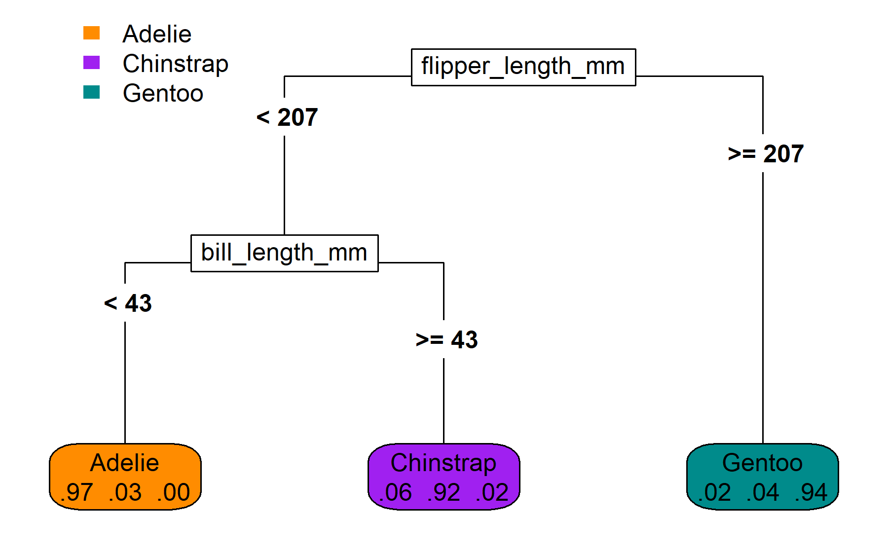

```{r, include=FALSE, echo=FALSE}

library(tidyverse)
library(lubridate)
library(gt)
library(table.glue)
library(palmerpenguins)
library(ggforce)
library(rpart)
library(party)
library(rpart.plot)
library(parttree)

knitr::opts_chunk$set(echo = FALSE, 
                      message = FALSE,
                      warning = FALSE,
                      dpi = 300,
                      fig.height = 7, 
                      fig.width = 11,
                      fig.align = 'center')

thm  <- theme_bw() + 
  theme(
    text = element_text(size=18, face = 'bold'),
    panel.grid = element_blank()
  )

theme_set(thm)

source("R/bench_pred_viz.R")

```


```{css, echo = FALSE}
.huge { font-size: 200% }
.large { font-size: 130% }
.small { font-size: 70% }
```

# Hello! My name is Byron 

.left-column[

I am an R enthusiast

I like walking my dog and learning (easy) cocktail recipes.

I study <br/> risk prediction using machine learning, generally cardiovascular disease.

]

.right-column[


]

---
class: center, middle, inverse

# .huge[Risk Prediction]

---

## Risk prediction

.large[__The goal__: predict the probability that a person will experience an event within a specific amount of time.]

.large[__The intent__: direct treatment to those who are most likely to benefit]

.large[__The result (in a perfect world)__:]

- .large[Shared decision-making between clinicians and patients]

- .large[Greater net benefit]

- .large[Lower number needed to treat]

---

## Risk prediction models

.large[__Traditional risk prediction equations__]

- .large[Cox proportional hazards]

- .large[fully parametric survival models] 

.large[__Risk prediction using machine learning__]

- .large[random forests]

- .large[boosted tree ensembles]

- .large[neural networks]


--

<br>
.huge[Machine learning in healthcare?]

---
background-image: url(img/meme_chicken_ml.jpg)
background-size: contain

---
background-image: url(img/segar_et_al.svg)
background-size: contain

---
background-image: url(img/segar_et_al_2.svg)
background-size: contain

---
background-image: url(img/segar_et_al_3.svg)
background-size: contain

---

## My perspective

Dr. Segar compared several machine learning algorithms using a standard and objective procedure to find the algorithm that gave the most accurate predictions.

--

The machine learning algorithm that won this benchmark was the oblique random survival forest (ORSF), a model I developed in 2019 😲.

--

Dr. Segar _almost_ didn't use my model!

- It took a very long time to run

- It didn't have a good method to estimate variable importance (we found a workaround for this)

---

## Lessons learned

I learned ORSF was a good model, but 

- nobody likes slow R packages

- interpretation is key

So I decided I needed to make an R package for ORSF that was fast and interpretable.

---
background-image: url(img/aorsf_website.svg)
background-size: contain

---

# This is who I am now 

.left-column[

I am an ~~R~~ `aorsf` enthusiast

I like `aorsf` ~~walking my dog and learning (easy) cocktail recipes.~~

I study `aorsf`<br/> ~~risk prediction using machine learning, generally cardiovascular disease.~~

]

.right-column[


]

---
class: center, middle, inverse

# .huge[Background]

---

## Two types of machine learning

.pull-left[

### Supervised

.large[Labeled data]

.large[Predict an outcome]

.large[Learners]


]

.pull-right[

### Unsupervised

.large[Unlabeled data]

.large[Find structure]

.large[Clusters]

.large[Organize medical records]


]

---

## For today

.pull-left[

### Supervised

.large[Labeled data]

.large[Predict an outcome]

.large[Learners (decision trees & random forests)]

.large[Risk prediction]

]

---
class: center, middle

# Labeled data

---
layout: true
## Labeled data

---

```{r out.width='90%', echo=FALSE, fig.align='center'}
knitr::include_graphics('img/ml-supervised-1.svg')
```

---


```{r out.width='90%', echo=FALSE, fig.align='center'}
knitr::include_graphics('img/ml-supervised-1-1.svg')
```

---

```{r out.width='90%', echo=FALSE, fig.align='center'}
knitr::include_graphics('img/ml-supervised-1-2.svg')
```

---

```{r out.width='90%', echo=FALSE, fig.align='center'}
knitr::include_graphics('img/ml-supervised-1-3.svg')
```

---

```{r out.width='90%', echo=FALSE, fig.align='center'}
knitr::include_graphics('img/ml-supervised-2.svg')
```

---

```{r out.width='90%', echo=FALSE, fig.align='center'}
knitr::include_graphics('img/ml-supervised-3.svg')
```

---

```{r out.width='90%', echo=FALSE, fig.align='center'}
knitr::include_graphics('img/ml-supervised-4.svg')
```

---

```{r out.width='90%', echo=FALSE, fig.align='center'}

```

---

```{r out.width='90%', echo=FALSE, fig.align='center'}
knitr::include_graphics('img/ml-supervised-8.svg')
```

---
layout: false
class: center, middle

# Predict an outcome

---
layout: true

## Predict an outcome

---

```{r out.width='90%', echo=FALSE, fig.align='center'}
knitr::include_graphics('img/ml-supervised-6.svg')
```

---

```{r out.width='90%', echo=FALSE, fig.align='center'}
knitr::include_graphics('img/ml-supervised-7.svg')
```

---

```{r out.width='90%', echo=FALSE, fig.align='center'}

```

---

```{r out.width='90%', echo=FALSE, fig.align='center'}

```

---
layout: false
class: center, middle, inverse

# .huge[Learners]

--

## .huge[(jargon)]

---

## Learners


.large[A *learner* is like a recipe for a prediction model]

--

- .large[A learner is not the same thing as a prediction model]

- .large[A recipe is not the same thing as the food!]

---

## What is a good learner for these data?

```{r}

set.seed(329)

n <- 50

x <- runif(n, min = 100, max = 160)

y_true <- scales::rescale(exp(-x/20), to = c(1, 12)) 

y_obs <- pmax(pmin(y_true + rnorm(n, mean=1), 15), 1)

ggdata <- tibble(x = x, y = y_obs) %>% 
 add_row(x = 120, y = 4)

p <- ggplot(ggdata) + 
 aes(x = x, y = y) + 
 labs(y = "Time until next blood pressure measure, months",
      x = "Systolic blood pressure today, mm Hg") + 
 scale_y_continuous(limits = c(-2, 15),
                    breaks = c(0, 2, 4, 6, 8, 10, 12, 14)) + 
 scale_x_continuous(limits = c(100, 160),
                    breaks = c(100, 120, 140, 160))

points <- geom_point(shape = 21, 
                     color = 'black', 
                     fill = 'orange', 
                     size = 4.5)

points_light <- geom_point(shape = 21, 
                           color = 'black', 
                           fill = 'orange', 
                           size = 4.5, 
                           alpha = 0.25)


p + points

m1 <- lm(y_obs ~ x)

x_new <- data.frame(x = seq(100, 160, len = 1000))

yhat_m1 <- m1 %>% 
 predict(newdata = x_new)

m2 <- lm(y_obs ~ poly(x, 3))

yhat_m2 <- m2 %>% 
 predict(newdata = x_new)


```

---

## Learner 1: find the line of best fit


```{r}

p + points + 
 geom_line(data = tibble(y = yhat_m1, x = x_new$x),
           color = 'purple', 
           size = 1.5)

```

---

## Learner 1: find the line of best fit

```{r}

library(magick)
library(ggforce)

raster <- image_read('img/person-standing.png') %>% 
 image_fill('none') %>% 
 as.raster()

circle_data <- tibble(
 x = 120,
 y = predict(m1, newdata = tibble(x=x)),
 label = paste("Our model's prediction\nfor Bill:", 
               round(y, 1), 'months')
)

p + points_light + 
 geom_line(data = tibble(y = yhat_m1, x = x_new$x),
              color = 'purple', 
              size = 1.5) + 
 geom_mark_circle(data = circle_data, 
                  aes(label = label), 
                  fill = 'orange', 
                  label.fontsize = 15,
                  expand = 0.02, 
                  label.fill = 'grey90') + 
 geom_segment(x = 120, 
              y = 2, 
              xend = 120, 
              yend = 6.3) + 
 annotate(geom = 'text',
          size = 6,
          x = 113,
          y = 1.5, 
          label = "Bill's SBP:\n120 mm Hg") +
 annotation_raster(raster, 
                   ymin = -2.2, 
                   ymax = 1.8, 
                   xmin = 115, 
                   xmax = 125)

```

---

## Learner 2: find the curve of best fit

```{r}

p + points + 
 geom_line(data = tibble(y = yhat_m2, x = x_new$x),
           color = 'purple', 
           size = 1.5)

```

---

## Learner 2: find the curve of best fit

```{r}

circle_data <- tibble(
 x = 120,
 y = predict(m2, newdata = tibble(x=x)),
 label = paste("Our model's prediction\nfor Bill:", 
               round(y, 1), 'months')
)

p + points_light + 
 geom_line(data = tibble(y = yhat_m2, x = x_new$x),
              color = 'purple', 
              size = 1.5) + 
 geom_mark_circle(data = circle_data, 
                  aes(label = label), 
                  fill = 'orange', 
                  label.fontsize = 15,
                  expand = 0.02, 
                  label.fill = 'grey90') + 
 geom_segment(x = 120, 
              y = 2, 
              xend = 120, 
              yend = 4.7) + 
 annotate(geom = 'text',
          size = 6,
          x = 113,
          y = 1.5, 
          label = "Bill's SBP:\n120 mm Hg") +
 annotation_raster(raster, 
                   ymin = -2.2, 
                   ymax = 1.8, 
                   xmin = 115, 
                   xmax = 125)
 
 

```

---

## Learner 3: connect the dots

```{r}

p3 <- p + points + 
 geom_line(color = 'purple', size = 1.5)

p3

```

---

## Learner 3: connect the dots

```{r}

circle_data$y <- 4

circle_data$label <- 
 "Our model's prediction\nfor Bill: 4 months"

p + points_light +
 geom_line(color = 'purple', 
           size = 1.5) + 
 geom_mark_circle(data = circle_data, 
                  aes(label = label), 
                  fill = 'orange', 
                  label.fontsize = 15,
                  expand = 0.02, 
                  label.fill = 'grey90') + 
 geom_mark_circle(data = circle_data, 
                  aes(label = label), 
                  fill = 'orange', 
                  label.fontsize = 15,
                  expand = 0.02, 
                  label.fill = 'grey90') + 
 
 geom_segment(x = 120, 
              y = 2, 
              xend = 120, 
              yend = 3.1) + 
 annotate(geom = 'text',
          size = 6,
          x = 113,
          y = 1.5, 
          label = "Bill's SBP:\n120 mm Hg") +
 annotation_raster(raster, 
                   ymin = -2.2, 
                   ymax = 1.8, 
                   xmin = 115, 
                   xmax = 125)

```


---

<iframe src="https://app.sli.do/event/skz3VjibsGSTe3YyF7D68v" height="90%" width="100%" frameBorder="0" style="min-height: 560px;" title="Which model?"></iframe>

---

```{r, out.width='80%'}

```


---
class: center, middle

# Comparing learners

---

```{r out.width='100%', echo=FALSE, fig.align='center'}
knitr::include_graphics('img/ml_abstraction.svg')
```

.footnote[Basic steps of ML. Source: [mlr3book](https://mlr3book.mlr-org.com/basics.html)]

---
class: inverse, center, middle

# Random Forests

---
background-image: url(img/penguins.png)
background-size: 45%
background-position: 85% 72.5%

## Decision trees

- Frequently used in supervised learning.

- Partitions the space of predictor variables.

- Can be used for classification, regression, and survival analysis. 

.pull-left[
We'll demonstrate the mechanics of decision trees by developing a prediction rule to classify penguin<sup>1</sup> species (chinstrap, gentoo, or adelie) based on bill and flipper length.
]

.footnote[
<sup>1</sup>Data were collected and made available by [Dr. Kristen Gorman](https://www.uaf.edu/cfos/people/faculty/detail/kristen-gorman.php) and the [Palmer Station](https://pal.lternet.edu/), a member of the [Long Term Ecological Research Network](https://lternet.edu/).
]

---

Dimensions for Adelie, Chinstrap and Gentoo Penguins at Palmer Station

```{r fig.align='center', fig.height=5, fig.width=7}

library(palmerpenguins)

ggplot(data = drop_na(penguins)) +
  aes(x = flipper_length_mm, y = bill_length_mm, label = species) +
  geom_point(aes(color = species, shape = species),
             size = 3,
             alpha = 0.8) +
  geom_mark_ellipse(aes(color = species, fill = species), 
                    alpha = 0.075) +
  theme_minimal() +
  scale_color_manual(values = c("darkorange","purple","cyan4")) +
  scale_fill_manual(values = c("darkorange","purple","cyan4")) +
  labs(x = "\nFlipper length, mm",
       y = "Bill length, mm\n",
       color = "Penguin species",
       shape = "Penguin species") +
  coord_cartesian(ylim = c(30, 70),
                  xlim = c(170, 235)) +
  theme(panel.grid = element_blank(),
        legend.position = '')

```

---

Partition all the penguins into flipper length < 207 or ≥ 207 mm

```{r fig.align='center', fig.height=5, fig.width=7}

mdl_tree <- rpart(formula = species ~ flipper_length_mm + bill_length_mm,
                  data = penguins, 
                  control = rpart.control(maxdepth = 1))

ggplot(data = penguins) +
  aes(x = flipper_length_mm, y = bill_length_mm, label = species) +
  geom_point(aes(color = species, shape = species),
             size = 3,
             alpha = 0.8) +
  geom_parttree(data = mdl_tree, aes(fill=species), alpha = 0.1) +
  theme_minimal() +
  scale_color_manual(values = c("darkorange","purple","cyan4")) +
  scale_fill_manual(values = c("darkorange","cyan4")) +
  labs(x = "\nFlipper length, mm",
       y = "Bill length, mm\n",
       color = "Penguin species",
       shape = "Penguin species") +
  coord_cartesian(ylim = c(30, 70),
                  xlim = c(170, 235)) +
  theme(panel.grid = element_blank(),
        legend.position = '')
```

---

Partition penguins on the left side into into bill length < 43 or ≥ 43 mm

```{r fig.align='center', fig.height=5, fig.width=7}

mdl_tree <- rpart(formula = species ~ flipper_length_mm + bill_length_mm,
                  data = penguins, 
                  control = rpart.control(maxdepth = 2))

penguin_fig_2parts <- ggplot(data = penguins) +
  aes(x = flipper_length_mm, y = bill_length_mm, label = species) +
  geom_point(aes(color = species, shape = species),
             size = 3,
             alpha = 0.8) +
  geom_parttree(data = mdl_tree, aes(fill=species), alpha = 0.1) +
  theme_minimal() +
  scale_color_manual(values = c("darkorange","purple","cyan4")) +
  scale_fill_manual(values = c("darkorange","purple","cyan4")) +
  labs(x = "\nFlipper length, mm",
       y = "Bill length, mm\n",
       color = "Penguin species",
       shape = "Penguin species") +
  coord_cartesian(ylim = c(30, 70),
                  xlim = c(170, 235)) +
  theme(panel.grid = element_blank(),
        legend.position = '')

penguin_fig_2parts

```

---

The same partitions, visualized as a binary tree.

```{r fig.align='center', out.width='100%'}



# png(res = 300,
#     width = 6,
#     height = 3.75,
#     units = 'in',
#     filename = 'rpart_plot_classif.png')
# 
# rpart.plot::rpart.plot(mdl_tree,
#                        box.palette = list("darkorange","purple","cyan4"))
# 
# dev.off()

```

Node text, top to bottom: predicted class type; predicted class probability; % of data in node;

---

## Forest = lots of trees

.large[Random forests are large sets of de-correlated decision trees (random-ness helps de-correlate)]

--

.large[Predictions from random forests are just the average prediction from each tree.]

---
class: inverse, center, middle

# Oblique random survival forest (ORSF)

--

## (Not as complicated as it sounds)

---

Remember when we grew a decision tree by partitioning the penguin data?

```{r fig.align='center', fig.height=5, fig.width=7}

penguin_fig_2parts 

```

---

With oblique splits, partitions do not need to be rectangles

```{r, fig.align='center', fig.height=5, fig.width=7}

x_delta <- 206.5 - 170
y_delta <- 46 - 40
slope <- y_delta / x_delta
intercept <- 46 - 206.5 * slope
text_lower <-
  table_glue("bill length - {slope} * flipper length < {intercept}")
text_upper <-
  table_glue("bill length - {slope} * flipper length \u2265 {intercept}")
data_poly <- tribble(
  ~flipper_length_mm, ~bill_length_mm    , ~species,
  170               ,  30                , 'Adelie',
  206.5             ,  30                , 'Adelie',
  206.5             ,  46                , 'Adelie',
  170               ,  40                , 'Adelie',
  170               ,  40                , 'Chinstrap',
  206.5             ,  46                , 'Chinstrap',
  206.5             ,  70                , 'Chinstrap',
  170               ,  70                , 'Chinstrap',
  206.5             ,  30                , 'Gentoo',
  235               ,  30                , 'Gentoo',
  235               ,  70                , 'Gentoo',
  206.5             ,  70                , 'Gentoo',
)
ggplot(data = penguins) +
  aes(x = flipper_length_mm, y = bill_length_mm, label = species) +
  geom_polygon(data = data_poly, 
               aes(fill = species, group = species),
               alpha = 0.2,
               col = 'black') +
  geom_point(aes(color = species, shape = species),
             size = 3,
             alpha = 0.8) +
  geom_text(
    data = tibble(flipper_length_mm = c(172, 172), 
                  bill_length_mm = c(68, 32), 
                  species = c(text_upper, text_lower)),
    hjust = 0
  ) + 
  theme_minimal() +
  scale_color_manual(values = c("darkorange","purple","cyan4")) +
  scale_fill_manual(values = c("darkorange","purple","cyan4")) +
  labs(x = "\nFlipper length, mm",
       y = "Bill length, mm\n",
       color = "Penguin species",
       shape = "Penguin species") +
  coord_cartesian(ylim = c(30, 70),
                  xlim = c(170, 235)) +
  scale_x_continuous(expand = c(0,0), breaks = c(180, 200, 220)) + 
  scale_y_continuous(expand = c(0,0)) +
  theme(panel.grid = element_blank(),
        legend.position = '')
```

---

A decision tree's predictions are the average of the observations in each leaf

```{r fig.align='center', out.width='100%'}


```

---

With survival trees, the 'average of the observations' is a survival curve.

```{r fig.align='center', out.width='100%'}

knitr::include_graphics('img/rpart_plot_surv.png')
# penguins_sim <- penguins %>%
#   mutate(
#     time_mean = if_else(
#       bill_length_mm < 40,
#       true = 40,
#       false = 20
#     ),
#     time = rnorm(n = n(), mean = time_mean, sd = 10),
#     time = pmax(time, 2),
#     status = rbinom(n = n(), size = 1, prob = 0.75)
#   )
# 
# library(party)
# 
# png(res = 300,
#     width = 6,
#     height = 3.75,
#     units = 'in',
#     filename = 'rpart_plot_surv.png')
# 
# mdl_ctree <-
#   ctree(formula = Surv(time, status) ~ bill_length_mm, 
#         data = penguins_sim,
#         controls = ctree_control(maxdepth = 1))
# 
# plot(
#   mdl_ctree,
#   inner_panel = node_inner(mdl_ctree, pval = FALSE)
# )
# 
# dev.off()
```

.footnote[the survival outcomes are simulated]

---
class: center, middle

# .huge[Learners]

---

## Learners for censored outcomes

Cox proportional hazards model 

- Forward / backward selection
- Regularization

--

Random forests

- Conditional inference
- Axis based & oblique

--

Boosting

- Boosted models
- Boosted decision trees

--

Neural networks

- Coxnet
- Deepsurv

---

## Software for the learners

```{r,echo=FALSE, cache=TRUE, warning=FALSE}

# gg_data <- tribble(
#  ~ package,       ~ learners,
#  'xgboost',         'boosted trees',
#  'ranger',          'random forest',
#  'glmnet',          'penalized regression',
#  'party',           'conditional inference forest',
#  'randomForestSRC', 'random forest',
#  'survivalmodels',  'neural networks',
#  'obliqueRSF',      'oblique random survival forest'
# ) %>%
#  mutate(
#   downloads = map(
#    package,
#    .f = cranlogs::cran_downloads,
#    from = today() - years(3),
#    to = today()
#   )
#  )
# 
# gg_plots <- gg_data %>%
#  mutate(downloads = map(downloads, select, -package)) %>%
#  unnest(downloads) %>%
#  filter(count > 0) %>%
#  group_by(package) %>%
#  mutate(cm = data.table::frollmean(count, n = 100)) %>%
#  nest() %>%
#  mutate(
#   plot = map(
#    .x = data,
#    .f =  ~ ggplot(drop_na(.x)) +
#    aes(x = date, y = cm) +
#    geom_point(alpha = 1/2) +
#    geom_smooth(method = 'lm',
#                formula = y ~ poly(x, 3),
#                se = FALSE,
#                color = 'red') +
#    scale_y_log10() +
#    theme_void()
#   )
#  ) %>%
#  select(-data)
# 
# gt_data <- gg_data %>%
#  mutate(
#   downloads = map_dbl(downloads, ~sum(.x$count)),
#   fig = NA
#  ) %>%
#  left_join(gg_plots, by = 'package') %>%
#  arrange(desc(downloads)) %>%
#  mutate(
#   downloads = table.glue::table_value(as.integer(downloads))
#  )
# 
# gt_data %>%
#  select(-plot) %>%
#  gt(rowname_col = 'package') %>%
#  text_transform(
#   locations = cells_body(columns = fig),
#   fn = function(x) {
#    map(
#     .x = gt_data$plot,
#     .f = ggplot_image,
#     height = px(40),
#     aspect_ratio = 3
#    )
#   }
#  ) %>%
#  tab_stubhead(label = 'R Package') %>%
#  cols_label(fig = 'Trends over time',
#             learners = 'Learner',
#             downloads = 'Total downloads') %>%
#  cols_align('left', columns = c('learners', 'downloads')) %>%
#  tab_options(table.width = pct(100)) %>%
#  tab_source_note(
#   paste("Data span from", today() - years(2),
#         "to", today())
#  )

```

```{r}

# prep the bm results ----

bm_pred_clean <- read_rds('data/bm_pred_clean.rds')
model_key <- read_rds("data/model_key.rds")
data_key <- read_rds("data/data_key.rds")


fig_chicago <- bm_pred_clean %>% 
 bench_pred_viz_chicago(data_key, 
                        model_key, 
                        model_subset = c("aorsf_fast", "ranger"))

fig_bm <- bm_pred_clean %>% 
 bench_pred_visualize(data_key, model_key)

```

---

```{r fig.height=9}

fig_chicago$small

```

---

```{r fig.height=9}

fig_chicago$big

```

---

```{r fig.height=9}

fig_bm$fig

```

---
class: center, middle

# .huge[BONUS ROUND]

---

## 2017 ACC/AHA High ASCVD risk

__Definition__: clinical CVD or __predicted 10-year ASCVD risk ≥ 10%__

As a matter of practical convenience, adults with stage 1 hypertension and 

- diabetes mellitus, 

- CKD (chronic kidney disease), or 

- ≥ 65 years of age 

are considered to have high ASCVD risk by the guideline. 

This recommendation was based on the assumption that most adults with diabetes, CKD, or ≥ 65 years of age are likely to have a 10-year predicted ASCVD risk ≥ 10% and data from surveys suggesting most clinicians, including cardiologists, do not assess ASCVD risk using recommended risk prediction tools.

.footnote[
<sup>1</sup>See Sections 9.3, 9.6, and 10.3 of  [the guideline](https://www.ahajournals.org/doi/pdf/10.1161/HYP.0000000000000065)
]

---

## Pooled cohort risk equations

Predict 10-year risk for a first atherosclerotic cardiovascular disease (ASCVD) event.

The American College of Cardiology and American Heart Association (ACC/AHA) recommend using these equations to guide clinical decisions related to the management and treatment of stage 1 hypertension.

--

- Nonpharmalogical therapy for all adults with stage 1 hypertension

- For adults with stage 1 hypertension **and high CVD risk**, nonpharmalogical therapy **and** initiation or intensification of antihypertensive medication

- High CVD risk = clinical CVD or predicted 10-year ASCVD risk ≥ 10%

--

Does this recommendation help direct antihypertensive medication to people who are most likely to benefit?

---
background-image: url(img/colantonio_2018.jpg)
background-size: 85%

---
